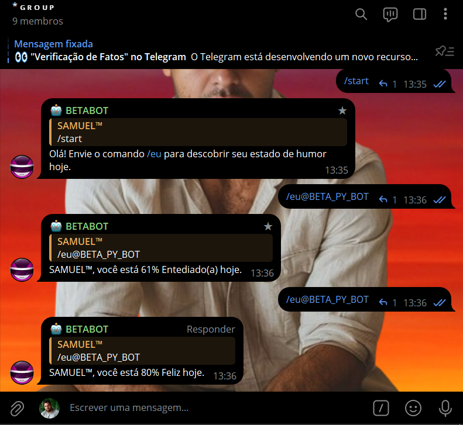

# ESTADO DE HUMOR
🧑‍💻QUANDO O USUÁRIO ENVIA O COMANDO `/EU`, O BOT RESPONDE COM UMA MENSAGEM PERSONALIZADA INFORMANDO O ESTADO DE HUMOR, BASEADO EM UMA PORCENTAGEM ALEATÓRIA E UMA LISTA DE HUMORES PRÉ-DEFINIDOS.

 <br>

## DESCRIÇÃO:
Este bot de Telegram, chamado "Estado de Humor", permite aos usuários verificar seu estado de humor diário de forma divertida e aleatória. Quando o usuário envia o comando `/eu`, o bot responde com uma mensagem personalizada informando o estado de humor do usuário para aquele dia, baseado em uma porcentagem aleatória e uma lista de humores pré-definidos.

## FUNCIONALIDADES:
1. **Comando `/start`**:
   - Quando o usuário envia `/start`, o bot responde com uma mensagem de boas-vindas e instruções sobre como utilizar o comando principal.
   - Exemplo de resposta: "Olá! Envie o comando /eu para descobrir seu estado de humor hoje."

2. **Comando `/eu`**:
   - Quando o usuário envia `/eu`, o bot responde com uma mensagem indicando o estado de humor do usuário para aquele dia.
   - A resposta inclui o nome do usuário, uma porcentagem aleatória de 1% a 100%, e um estado de humor escolhido aleatoriamente a partir de uma lista de humores.
   - Exemplo de resposta: "Lucas, você está 92% Rabugento(a) hoje."

## EXECUTANDO O PROJETO:
1. **Coloque o Token:**
   - Antes de executar, é necessário introduzir o token do seu bot no arquivo `./CODIGO/TOKEN.py`, o qual pode ser obtido por meio do [@BotFather](https://t.me/BotFather). 

2. **Instalando as dependências:**
   - Antes de executar o bot, certifique-se de instalar todas as dependências necessárias. No terminal, execute o seguinte comando para instalar as dependências listadas no arquivo `requirements.txt` em `CODIGO`:
   ```bash
   pip install -r requirements.txt
   ```

3. **Inicie o Bot:**
   - Execute o bot do Telegram em Python iniciando-o com o seguinte comando:
   ```bash
   python CODIGO.py
   ```

4. **Interagindo com o Bot:**
   1. **Inicie o bot**:
      - Para começar a usar o bot, você deve iniciar uma conversa com ele no Telegram.
      - Procure pelo nome do bot (definido quando você criou o bot com o BotFather) e clique em "Start" ou envie o comando `/start`.

   2. **Obtenha seu estado de humor**:
      - Envie o comando `/eu` para o bot.
      - O bot responderá com uma mensagem indicando seu estado de humor para o dia.

## ARQUIVO `HUMOR.json`:
O bot utiliza um arquivo chamado `HUMOR.json` que contém uma lista de possíveis estados de humor. O arquivo deve estar no mesmo diretório que o script do bot e deve ter o seguinte formato:
```json
[
    "Rabugento(a)",
    "Feliz",
    "Triste",
    "Animado(a)",
    "Cansado(a)",
    "Entediado(a)",
    "Nervoso(a)",
    "Calmo(a)"
]
```

## NÃO SABE?
- Entendemos que para manipular arquivos em muitas linguagens e tecnologias relacionadas, é necessário possuir conhecimento nessas áreas. Para auxiliar nesse aprendizado, oferecemos alguns subsidios:
* [CURSO DE TELEBOT](https://github.com/VILHALVA/CURSO-DE-TELEBOT)
* [CURSO DE PYTHON](https://github.com/VILHALVA/CURSO-DE-PYTHON)
* [CURSO DE JSON](https://github.com/VILHALVA/CURSO-DE-JSON)
* [CONFIRA MAIS CURSOS](https://github.com/VILHALVA?tab=repositories&q=+topic:CURSO)

## CREDITOS:
- [PROJETO INSPIRADO NO "Lulu"](https://github.com/viniciusvrc/Lulu)
- [PROJETO FEITO PELO VILHALVA](https://github.com/VILHALVA)
